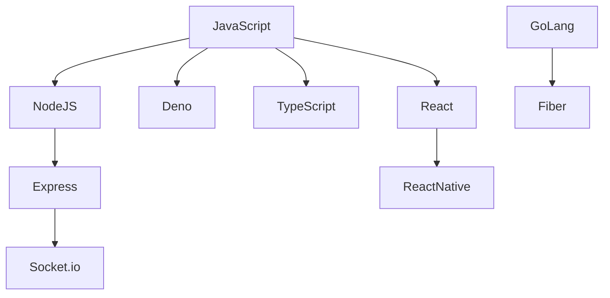
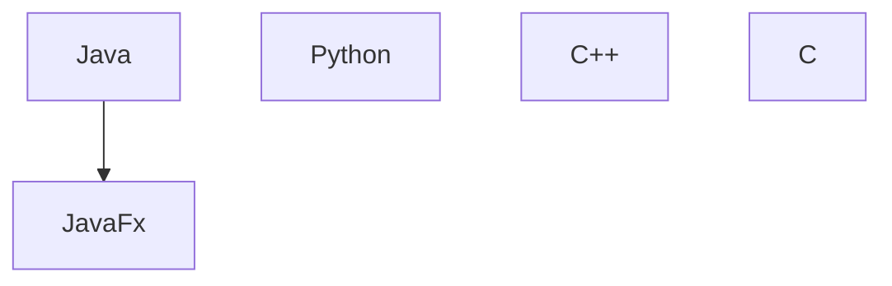

 

  
  <h1>Jefferson Silva</h1>

# About Me
Hello, World!🖖 My name is Jefferson, i'm Brazilian, i love work whit JS/NodeJS e GoLang.

## My Skills
### I'm Work 

```mermaid
  graph TD;
      JavaScript-->NodeJS-->Express-->Socket.io;
      JavaScript-->Deno;
      JavaScript-->TypeScript;
      JavaScript-->React-->ReactNative;;
      GoLang-->Fiber;
```

### I'm only a base

```mermaid
  graph TD;
      Java-->JavaFx;
      Python;
      C++;
      C;
```

